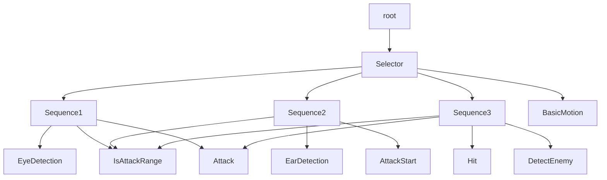

# Mosquito
mosquito Game Dev

## BT
아래는 Human AI의 행동트리입니다.

```mermaid
graph TD;
  root --> Selector;
  Selector --> Sequence1;
  Selector --> Sequence2;
  Selector --> Sequence3;
  Sequence1 --> EyeDetection;
  Sequence1 --> IsAttackRange;
  Sequence1 --> Attack;
  Sequence2 --> EarDetection;
  Sequence2 --> IsAttackRange;
  Sequence2 --> AttackStart;
  Sequence3 --> Hit;
  Sequence3 --> DetectEnemy;
  Sequence3 --> IsAttackRange;
  Sequence3 --> Attack;
  Selector --> BasicMotion;
```
